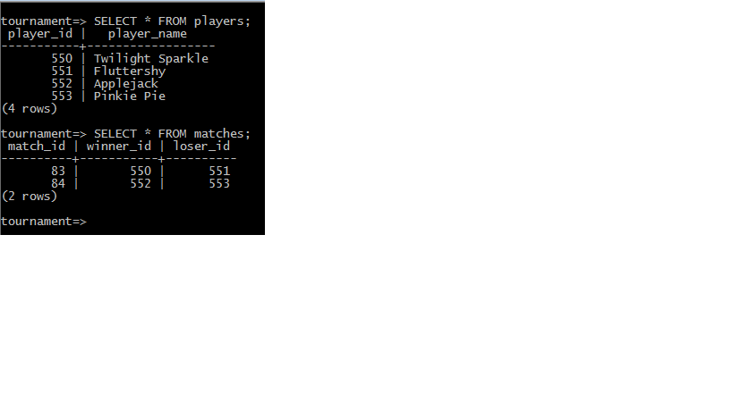

Database Tables
==============================================
The tournament.sql file contains the schema of the tournament database. It contains 2 tables:
	- players
	- matches

Below is a sample of the tables and some elements inserted:

   players and matches table

